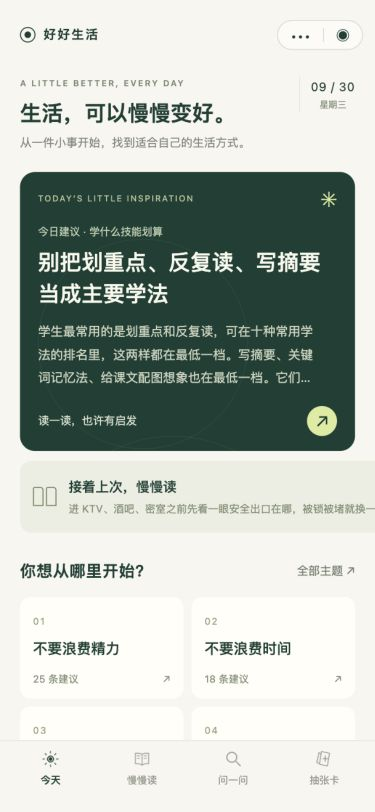
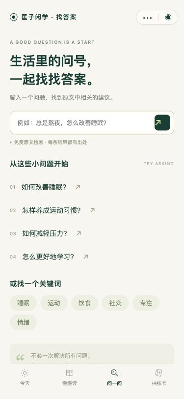
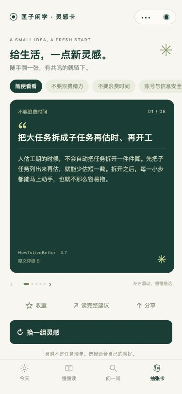

# 好好生活

把有出处的生活建议装进口袋。基于 [HowToLiveBetter](https://github.com/eternity4719/HowToLiveBetter) 的原生微信小程序与手机网页版，支持顺序阅读、问题检索、随机卡片和本地收藏。网页版名称为“好好生活”，微信小程序审核名称保留“匡子闲学”。

**网页版已发布：[打开好好生活](https://easy-life.kznb.workers.dev/)。** Cloudflare 默认地址已完成调整，新地址 HTTP 200，Chrome 卡片页渲染通过；网页版名称已更新为“好好生活”并通过线上验证，网址保持不变。尚未绑定独立域名。此前已收到手机移动网络无法访问的反馈，新地址的国内手机网络访问仍需真机验证。

**微信小程序仍为开发版本，尚未正式发布。** 小程序名称已按项目所有者确认更新为“匡子闲学”；本机真实 AppID 已配置，开发者工具编译与模拟器检查已通过。主体类目和前置审批要求、最终备案结果、真机验收、体验版、提审与发布仍需逐项完成和核实。用户不需要登录；首版不使用业务后端、云开发、模型 API 或付费依赖。

## 产品

| 入口 | 已实现 |
| --- | --- |
| 今天 | 每日固定建议、从第一页开始、继续上次阅读、生活主题 |
| 慢慢读 | 34 章 / 630 条，章节目录、收藏、已读状态 |
| 问一问 | 中文关键词与同义表达检索，如“工资没发”“学不进去”；结果连接原文与来源；空结果明确提示 |
| 抽张卡 | 40 条日常建议精选池，每组最多 5 条，左右切换、按主题换组、收藏 |
| 阅读详情 | 完整建议、成本、收益、原文评级与限定条件、备注、引文、上一篇/下一篇 |
| 关于 | 来源许可、版本、隐私说明、本地数据清除、运营联系和备案信息配置 |

米白底、墨绿文字和卡片、浅黄绿色点缀。随机推荐只取日常主题；健康、急救、法律、金融等仍可从目录主动查阅。原文评级沿用作者口径，不是本项目的权威认证。

<p>
  
  
  
</p>

截图来自复用原生页面代码的浏览器预览，非微信真机截图。

“问一问”是本地资料检索，**不会生成新的回答或判断个人情况**。同义词词典覆盖常见表达，但不是完整语义理解；问题较宽泛时可改用具体关键词。离线内容只代表所锁定版本，不自动追踪法规或医学更新。

## 手机网页版

标准浏览器界面，适配手机与桌面，包含完整阅读、出处检索、随机卡片、收藏、浏览器返回与文章分享链接。内容与检索复用小程序模块，无需登录或后端。页面数据仅留在当前浏览器。

```sh
npm run web
```

打开 <http://127.0.0.1:4173/>。`npm run build:web` 生成可部署的 `dist/`，仅导出公开网页文件。Cloudflare Workers Builds 已连接本仓库的 `main` 分支，发布前执行检查和构建；域名拟用 `kuangzi.cc`，尚未注册。详见[网页版与域名上线指南](docs/WEB-LAUNCH.md)。

## 小程序设计预览

需要 Node.js 20 或更新版本，无需 `npm install`。

```sh
npm run preview
```

浏览器打开 <http://127.0.0.1:4173>。预览直接复用原生 WXML、WXSS、页面 JS 和内容检索逻辑，通过一个本地适配器提供点击体验。支持目录、搜索、卡片和收藏；微信分享、胶囊、权限、真实排版和包编译仍必须在微信工具及真机验证。预览存储在当前浏览器，与微信设备数据隔离。

## 在微信开发者工具运行

1. 根据 [首次发布指南](docs/WECHAT-LAUNCH.md) 注册自己的小程序，取得 AppID。
2. 从[微信官网](https://developers.weixin.qq.com/miniprogram/dev/devtools/download.html)安装开发者工具。
3. 在本机配置 AppID（应用标识，不是 AppSecret）：

   ```sh
   npm run configure -- wx0123456789abcdef
   ```

   这里的示例必须换成自己的真实值。脚本仅写入被 Git 忽略的 `project.private.config.json`，不会修改公开仓库中的 `project.config.json`。微信开发者工具优先读取私有配置中的 AppID；后续可在本机私有文件中修改，不必发到聊天或 GitHub。

   公共配置始终保留 `touristappid`，仅供本地游客试用，不具备上传资格。AppSecret、上传私钥和其他凭证不得写入小程序代码或公开仓库。

4. 导入**仓库根目录**，由 `project.config.json` 自动识别 `miniprogram/`。不用创建云开发环境，不用构建 npm。
5. 点击编译、检查控制台，再预览到手机。首发至少在 iOS 和 Android 各验收一次。
6. 补齐 `miniprogram/config/release.js` 的真实公开资料，完成备案与类目审核，再按发布指南上传、提审、发布。

本地发布字段检查：`node scripts/check.mjs --release`。AppID 或运营/联系/备案信息没填时会明确失败；检查通过也不等于平台审核通过。

## 验证与内容更新

```sh
npm run verify
```

包含可复现导入、内容完整性/引文、检索相关性、随机切换、本地存储异常和真实页面逻辑测试，以及页面配置、事件处理、JS 语法和主包源码大小检查。GitHub Actions 同样执行此命令。源码体积检查采用保守 2 MiB 上限，最终包大小以开发者工具为准。

内容固定在上游提交 `e91118de217945dfb8e3561dddc74c97cc64a707`，原文时间为 2026-09-29。日常重建完全离线：

```sh
npm run content
```

有意升级内容时，先下载并审阅上游新版本，显式修改 `scripts/import-content.mjs` 中的固定提交和预期章节/条目数量，更新相应完整性测试，再执行：

```sh
node scripts/import-content.mjs --source /path/to/HowToLiveBetter
npm run verify
```

审查 `content/provenance.json`、原稿和生成数据差异。编辑修订绑定原备注哈希；上游修改了相关备注时导入会拒绝套用旧补丁，需要人工重新核对。内容更新会改变条目编号；当前收藏使用章号与条号，升级前必须检查编号是否重排并设计迁移。不要盲目自动跟随上游。

## 来源与修改

原作者：eternity4719 及 HowToLiveBetter 贡献者。原文使用 [CC BY 4.0](https://creativecommons.org/licenses/by/4.0/)，代码采用 MIT。此项目是独立改编，没有声称得到原作者或微信官方背书。

保留 34 章原稿、许可证、原文 README、固定 commit、文件哈希、完整来源与原文链接；结构化整理和界面属于本项目新增。对 `1-5` 误食蘑菇后“催吐”的备注做了**显式安全修订**，产品展示修订文案及依据，原始快照保持原样。详见 [内容署名与修改说明](content/NOTICE.md) 及 [修订记录](content/editorial-overrides.json)。其余内容不代表已完成医学、法律或金融的专业审校，发布前仍需核对时效与平台准入。

## 目录

```text
miniprogram/          原生小程序（唯一上传目录）
  pages/             首页、阅读目录、搜索、卡片、详情、关于
  utils/             同一套内容检索、随机与本地存储逻辑
  data/book.js       可复现生成的完整内容
  config/release.js  公开的运营与备案信息
content/             原稿快照、许可、来源版本与编辑记录
scripts/             导入、校验、配置、电脑预览服务
preview/             本地设计预览适配器，不上传微信
web/                 手机浏览器正式界面，共享内容与检索逻辑
dist/                生成的公开静态网页，不提交 Git
tests/               Node 内置测试器，无第三方依赖
docs/                注册、备案、验收和发布说明
```

首版没有用户账号、广告、埋点或远程数据采集。收藏和进度保存在当前设备，卸载或清理数据会丢失；不会跨设备同步。搜索词只在当前页面内存处理，不保存或上传。复制来源由用户主动触发。增加任何网络/统计/生成服务后，应重新更新产品声明和微信隐私指引。
